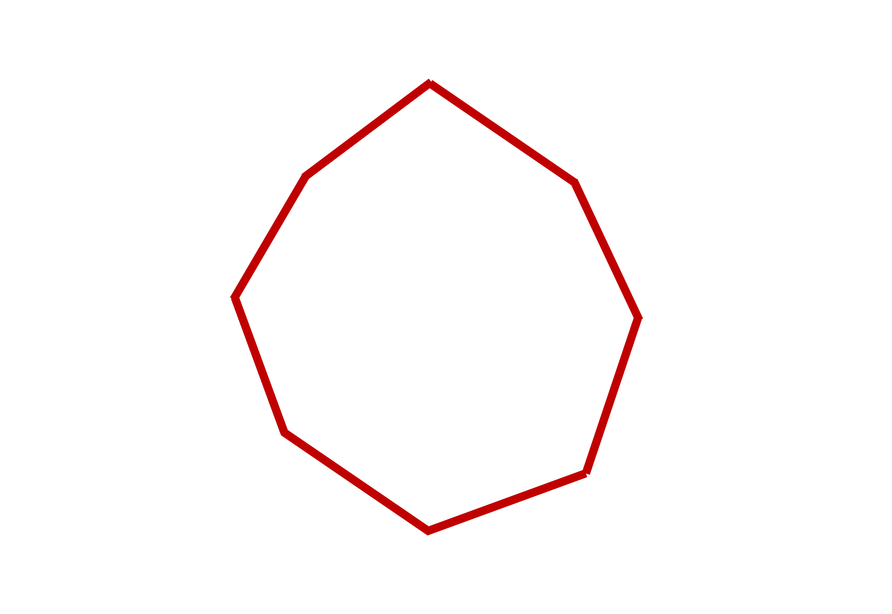

<!--========== SKILLS ==========-->
<!-- Introduction -->
We are always learning new technologies and we try to specialize in those we think are the most interesting for us. 
Here you can check my personal soft and hard skills.

<!-- Soft skills -->
## Soft skills

<ul style="margin-left: 20px">
<li>Communication</li>
<li>Self motivation</li>
<li>Teamwork</li>
<li>Commitment</li>
<li>Adaptability</li>
<li>Problem solving</li>
<li>Conflict resolution</li>
<li>Critical thinking</li>
<li>Emotional intelligence</li>
</ul>

 
 
<!-- End soft skills -->

<!-- Hard skills -->
## Hard Skills

 
<!-- End hard skills -->

<!-- Technical skills -->
## Technical Skills

<ul style="margin-left: 20px">
<li>Docker</li>
<li>GitHub</li>
<li>Linux</li>
<li>Windows</li>
<li>Macintosh</li>
<li>Azure</li>
<li>Bash</li>
<li>Powershell</li>
<li>VMWare</li>
<li>Veeam Backup</li>
<li>ArcServe Backup</li>
<li>ServiceNow</li>
<li>Office 365</li>
</ul>

 

 
<!-- End hard skills -->

<!-- Go to work button -->
<form action="https://rferran.github.io/work.html">
    <input type="submit" value="Go to Work" />
</form>
<!-- End go to work button -->
<!--========== END SKILLS ==========-->
